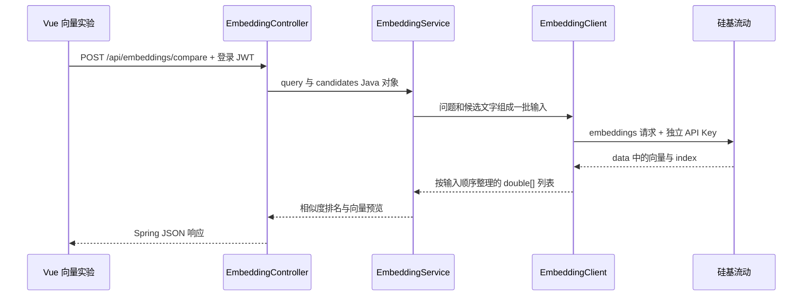

# 第 25 课：Embedding，用硅基流动生成向量并比较文字

上一课把正文切成了文本块。本课新增“向量实验”：输入一个问题和三段候选文字，调用硅基流动的 `BAAI/bge-m3`，展示向量维度与相似度排名。可以手动粘贴上一课的块来比较。

## 一、先运行本课

在 [硅基流动控制台](https://cloud.siliconflow.cn/) 创建 API Key，将下面三行补充到本机 `docker/.env`。密钥只在本机填写，保留已有数据库、MinIO、JWT 与 GLM 配置；不要将整个文件替换为这个片段。

```dotenv
EMBEDDING_ENDPOINT='https://api.siliconflow.cn/v1/embeddings'
EMBEDDING_MODEL='BAAI/bge-m3'
EMBEDDING_API_KEY='在本机填写硅基流动密钥'
```

示例文件为 `docker/.env.embedding.example`。截至 2026-09-22，[官方价格页](https://siliconflow.cn/pricing)将 `BAAI/bge-m3` 列为免费；带 `Pro/` 前缀的版本收费。本课明确使用前者。免费服务仍有账户权限、限流和可用性限制，价格以平台后续公告为准。

如果从项目根目录的终端启动后端，运行：

```sh
scripts/backend.sh spring-boot:run
```

脚本会读取 `docker/.env`。如果直接在 IDEA 运行 Java 启动类，须在该运行配置的“环境变量”中填入上面三项；IDEA 不会因为文件存在就自动读取它。已经运行的进程不会自动获得新环境变量，需要重启。8080 已占用时先停止自己启动的旧后端，再启动一次。

前端启动命令为 `npm run dev --prefix frontend`。开发服务显示访问地址后持续运行是正常状态，不会自动退出。登录后打开侧栏“向量实验”，确认显示 `BAAI/bge-m3`，点击“计算相似度”。“检查配置”只校验字段格式，不验证密钥有效性，也不发送文字到模型。

本课不需要下载模型或启动本地模型服务。聊天继续使用智谱 GLM；Embedding 使用独立密钥。点击计算时，页面的问题和候选文字会发送到硅基流动。

## 二、Embedding 的作用是什么

Embedding 模型把一段文字转换为一组浮点数，例如 `[0.12, -0.08, …]`。模型在训练中学习文本之间的关系，使语义相关的文字通常具有更接近的向量方向。它不生成回答，也不是把每个字替换成固定编号。

向量有多少个坐标，就称为多少维。维度与文字长度、token 数是不同概念：长短不同的文本，在同一配置下仍输出相同维度。单独一个坐标通常不能解释为“上传程度”或“登录程度”；语义由整组数字共同表示。页面展示本次实际返回的维度，前八个坐标只用于观察。

GLM 负责“根据上下文写回答”，Embedding 负责“把文字表示成可比较的向量”。后续 RAG 会先找相关文本块，再把这些文字交给 GLM。

## 三、请求经过哪些代码



这里没有 Mapper：本课访问的是模型 HTTP 服务，并未读写数据库。Controller 的 Java 返回对象由 Spring 的 JSON 消息转换器序列化，前端 Axios 将 JSON 解析为 JavaScript 对象。

## 四、Controller 接收什么

文件：`backend/src/main/java/com/example/aiknowledge/controller/EmbeddingController.java`。

```java
public record Request(String query, List<String> candidates) {}
```

`@RequestBody` 将请求 JSON 的两个字段绑定到这个 Java record。Controller 将它们交给 Service，不在接口层直接计算向量。

`GET /api/embeddings/config` 只返回模型名与配置是否完整；不会返回密钥或完整服务地址。两个接口都要求登录且拥有 `chat:send` 权限，USER、EDITOR、ADMIN 沿用已有授权。成功响应使用 `Cache-Control: no-store`。

## 五、Client 如何调用模型

文件：`backend/src/main/java/com/example/aiknowledge/service/EmbeddingClient.java`。

关键请求内容如下：

```json
{
  "model": "BAAI/bge-m3",
  "input": ["如何上传文件？", "在文档管理中选择文件并上传。", "番茄炒蛋的做法。"],
  "encoding_format": "float"
}
```

`model` 选择向量模型，`input` 数组将问题和候选文本放在同一次调用里，`encoding_format` 要求返回数字数组。`HttpClient` 发出 POST 请求，使用后端 `EMBEDDING_API_KEY` 构造 Bearer 请求头，浏览器的登录 JWT 不会转发给服务商。[接口定义见官方文档](https://api-docs.siliconflow.cn/docs/api/embeddings-post)。

响应中每条记录包含 `index` 和 `embedding`。`index=0` 对应问题，后续索引对应候选文字。`decode()` 根据 index 恢复输入顺序，不能假设服务商返回的数组恰好排好序。

代码检查数量、索引范围和重复索引，然后检查维度一致、每项为数值、向量有限且非零。任何检查失败都会报错，不会编造一组数字继续排名。当前最多接受 4096 维。

`BoundedBody` 在接收过程中限制响应为 2 MiB；整体等待最多 90 秒，覆盖响应体接收。超时取消等待，服务不自动重试。上游 401/403 转为本应用的 502 并提示检查模型密钥，避免误让用户退出登录；429 提示稍后手动重试。错误不会原样返回服务商响应或密钥。

## 六、Service 如何计算相似度

文件：`backend/src/main/java/com/example/aiknowledge/service/EmbeddingService.java`。

Service 首先检查候选数为 1–5，每段文字及问题为 1–1000 个 UTF-16 字符且不能全为空白。页面提供三个候选框。这个字符限制是本课的小实验限制，不是模型的 token 上限；官方接口给 `BAAI/bge-m3` 的单条输入上限为 8192 token，字符不能与 token 直接画等号。

```java
var inputs = new ArrayList<String>();
inputs.add(query);
inputs.addAll(candidates);
var vectors = client.embed(inputs);
```

这段代码保证问题与候选使用同一模型、同一批次生成。接下来逐一比较 `vectors.get(0)` 与其余向量。

余弦相似度公式是：

```text
cosine(a, b) = Σ(a[i] × b[i]) / (长度(a) × 长度(b))
```

代码用 `Math.hypot` 累积向量长度，再将坐标除以长度后相乘求和，减少直接平方大数造成溢出的风险。例如 `[1,0]` 和 `[2,0]` 的方向相同，分数为 1；`[1,0]` 和 `[0,1]` 为 0。零向量不能计算，因此被拒绝。这些二维数字只用于讲解，真实结果来自服务商。

理论范围是 -1 到 1，代码将浮点误差夹回这个范围。分数越高说明本模型下方向越接近，不能解释为“有 80% 的概率回答正确”。相关性阈值需要用实际业务样本评估。

```java
matches.sort(Comparator.comparingDouble(Match::similarity)
    .reversed().thenComparingInt(Match::index));
```

先按分数降序排序，分数相同则保持原候选顺序。`head()` 只截取前八个数字作为页面预览；余弦计算使用全部维度。

`Semaphore(1)` 将本后端进程的实验限制为一次一个，繁忙时立即提示；`finally` 在成功或失败后都释放名额。它不是跨多台服务器的全局限流。

## 七、Vue 如何避免展示旧结果

页面为 `frontend/src/views/EmbeddingView.vue`，请求封装在 `api/embeddings.js`，状态管理在 `utils/embeddingExperiment.js`。

点击提交后先校验、清空旧结果并设置 busy，按钮在计算期间禁用。接口返回后，只有请求代次 generation 和登录会话 sessionVersion 都仍匹配，结果才能写入 ref。离开页面会取消接收并清空结果。取消浏览器请求不保证服务商已停止计算。

文字通过 Vue 插值展示，不把用户内容当 HTML 执行。向量不会写入 localStorage、MySQL 或 Qdrant，换页后需要重新计算。

## 八、以后怎样换收费模型

保留独立的 `EMBEDDING_ENDPOINT`、`EMBEDDING_MODEL`、`EMBEDDING_API_KEY`。后续选择支持上述请求格式及 `data[].index/embedding` 响应格式的服务时，修改三项并重启后端即可；格式不同则修改 Client 适配，Service 的相似度计算可以复用。

没有自动转付费或备用模型机制。不同模型的向量空间通常不能混用，即使维度相同也不能直接比较。本课尚未存向量，所以重算当前实验即可；以后接入 Qdrant，换模型需要重新生成文档向量并重建对应索引，还应记录模型及维度版本。

## 九、验证与练习

自动测试使用模拟 HTTP 上游，验证独立密钥、批量输入、乱序索引、异常向量拒绝、权限、错误后恢复、余弦计算及前端旧请求隔离。未使用真实硅基流动密钥调用模型；真实效果需要你完成第一节配置后验收。

1. 用默认问题比较上传说明、登录说明和做饭说明，观察排名。
2. 把问题改为“我应该如何登录？”，再次计算，观察排序变化。
3. 粘贴第 24 课的三块文字，再问一个能在其中找到答案的问题。
4. 思考：为什么只显示八个坐标，却不能只用这八个数字计算相似度？

当前实验没有自动读取文档、保存分块或将检索结果交给聊天模型。下一课学习 Qdrant：保存向量，并根据问题向量查找相近的文本块。正式索引应读取完整文档，不能把前两课受限的正文预览当成全文。
