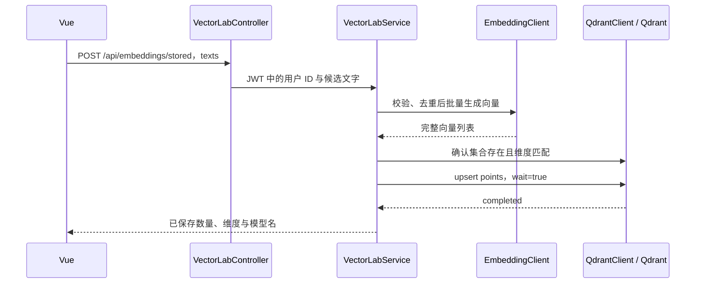

# 第 26 课：Qdrant，让向量保存下来并支持检索

第 25 课每次都把问题与候选文字一起向量化，比较后结果留在页面内存。这一课增加“保存后检索”：先把候选文字与向量写入 Qdrant，之后只为新问题生成向量，从已保存的文字中找出最相近的三段。

## 一、运行与验收

在项目根目录执行：

```sh
docker compose -f docker/compose.yml up -d qdrant
```

本课固定使用 `qdrant/qdrant:v1.19.1`，数据保存到 Docker 的 `qdrant_data` 命名卷。Qdrant 是向量数据库；Embedding 仍由硅基流动 `BAAI/bge-m3` 计算，无需下载本地 Embedding 模型。容器与端口的基础用法见 [Qdrant 官方快速开始](https://qdrant.tech/documentation/quickstart/)。

重启新版后端。使用终端启动时仍运行 `scripts/backend.sh spring-boot:run`；使用 IDEA 时沿用第 25 课的 Embedding 环境变量。新配置 `QDRANT_ENDPOINT` 默认是 `http://127.0.0.1:6333`，本机通常不需要填写。不要再启动第二个占用 8080 的后端。

前端沿用 `npm run dev --prefix frontend`。登录后打开“向量实验”：

1. 保留上传、登录、做饭三段候选文字，滚动到“保存后检索”。
2. 点击“保存上面的候选文字”，看到已保存数量为 3。
3. 在下方输入“怎样上传文件？”，点击检索，查看排名与原文。
4. 刷新页面并重新登录同一账号，直接在下方输入问题检索，不必再次保存。
5. 再次保存相同文字，数量仍为 3；修改其中一段后保存，会追加新文字，旧文字仍保留。

也可以访问 [Qdrant 管理页面](http://127.0.0.1:6333/dashboard) 观察集合与 points。页面用于本机开发，直接连接 Qdrant，不受本项目登录体系保护。Compose 只将 6333 绑定到本机回环地址；不要将它直接暴露到公网。本课没有配置生产环境 Qdrant 鉴权。

## 二、它和 MySQL、MinIO 分别做什么

| 组件 | 本项目中的职责 |
| --- | --- |
| MySQL | 用户、权限、知识库和文档元数据 |
| MinIO | PDF、DOCX 等原始文件字节 |
| 硅基流动 Embedding | 将文字转换成向量 |
| Qdrant | 保存向量与关联文字，查找相近向量 |

本课是独立练习库，手动保存的文本不会自动关联知识库或原文件。正式文档索引以后还要保存 documentId、chunkIndex、知识库归属和处理版本等信息。

## 三、Collection、Point、Payload 是什么

Collection 是一组按共同规则保存的向量。创建时指定维度与距离算法；本课使用模型实际返回的维度，以及上一课学过的 Cosine。

一个 Point 可以理解为一条向量记录：

```json
{
  "id": "76874cce-1fb9-4e16-9b0b-f085ac06ed6f",
  "vector": [0.1, 0.2, 0.3],
  "payload": {
    "text": "在文档管理中选择文件并上传。",
    "model": "BAAI/bge-m3"
  }
}
```

上面的三维数组仅用于解释结构，真实代码使用完整模型向量。`id` 标识记录，`vector` 用于比较，`payload` 保存附加信息。检索返回 payload 后才能展示原文，不能由向量数字反推出原文。

Collection 不等同于 MySQL 表，Payload 也不等同于向量坐标；这是三种不同职责。

## 四、保存请求如何执行



`VectorLabController.java` 接收 JSON，用 `@AuthenticationPrincipal Jwt jwt` 读取已经验证的身份。用户 ID 来自 JWT 的 subject，客户端不能传入别人的 ID 来指定存储位置。保存、状态和搜索接口都要求 `chat:send` 权限。

`VectorLabService.save()` 限制一次 1–5 段、每段 1–1000 个 UTF-16 字符。关键代码是：

```java
var unique = texts.stream().map(String::strip).distinct().toList();
var vectors = embedding.embed(unique);
qdrant.ensure(name, vectors.get(0).length);
```

第一行去除两端空白并去掉当前批次重复文字；第二行调用上一课的 Client；第三行用真实维度创建或检查集合。先得到合法向量再写库，模型失败时不会把伪造结果写入 Qdrant。

## 五、为什么重复保存不会越来越多

```java
var id = UUID.nameUUIDFromBytes(text.getBytes(StandardCharsets.UTF_8)).toString();
```

这个方法根据规范化后的文字生成稳定 UUID。相同文字在同一集合内得到相同 ID，upsert 遇到相同 ID 会覆盖该记录；不同文字通常得到不同 ID。这适合教学去重，不能充当加密或文档授权机制。

`QdrantClient.upsert()` 使用 `PUT /collections/{name}/points?wait=true`。`wait=true` 表示等待修改实际完成，代码还检查操作状态为 completed 才继续返回成功。[官方 upsert 定义](https://api.qdrant.tech/api-reference/points/upsert-points)明确说明了同 ID 覆盖与等待行为。

它并不是“用输入框替换整个练习库”。新增文字会追加，输入框删掉某段不会删除库中的旧记录。重复点击仍会重新调用 Embedding，只是不增加同文本的 point 数量。

超时意味着结果尚未确认，写入可能已经完成。系统不会自动重试；先刷新状态，再决定是否重新保存。模型调用与向量数据库操作不是一个跨服务事务。

## 六、如何防止混用账号或模型

```java
String collection(long userId) {
    return "lesson26_u" + userId + "_" + embedding.spaceId();
}
```

本课为每个账号和模型空间创建独立集合。`spaceId()` 对规范化的 Embedding 地址与模型名计算 SHA-256；密钥不参与，所以仅轮换 API Key 不会改变集合。

切换模型或服务地址后会进入另一集合，旧数据仍在原集合中；切回相同配置可以访问原练习数据。集合名由后端决定，不接受浏览器输入，因此本应用的用户无法通过参数选择别人的集合。

`ensure()` 发现集合已存在时，检查其 size 与 Cosine 距离规则。维度不匹配返回 409，不自动删库重建。[创建集合的结构见官方接口](https://api.qdrant.tech/api-reference/collections/create-collection)。

地址与模型名是一层基础隔离；如果服务商在相同模型名下更新向量空间，单凭这些字段仍不能识别。正式系统还需要显式的模型版本和索引版本，并执行重新向量化。每用户一个集合也只是本课的小规模练习方式，后续多租户设计不能无限照搬。

## 七、检索为什么只需要发送问题

`VectorLabService.search()` 先读取当前账号的集合，没有已保存文字就提示先保存，不调用模型。集合存在后执行：

```java
var vector = embedding.embed(List.of(query)).get(0);
qdrant.verify(info, vector.length);
var points = qdrant.search(name, vector);
```

候选文字的向量已经在库中，因此只需为问题生成一个向量。接着校验维度，把问题向量交给 Qdrant。

Qdrant 请求的关键字段：

```text
query        问题向量
limit        3，最多返回三条
with_payload true，带回文字
with_vector  false，不带回整组向量
```

Qdrant 执行相似度搜索并返回 score 与 payload。后端将它们整理成 `Hit(text, score)`，Spring 序列化成 JSON，Vue 展示文字和排名。本课使用 `POST /collections/{name}/points/query`，参见 [官方查询接口](https://api.qdrant.tech/api-reference/points/query-points)。

Top 3 表示在已有记录中最相近的三条，不保证一定相关；没有相关内容也可能返回结果。分数不是正确率。本课仍未把检索到的文字交给 GLM 生成回答。

## 八、为什么刷新、重启后还在

Vue 的状态只负责当前画面。保存后的文字和向量由 Qdrant 写到存储目录，Compose 将该目录挂载到命名卷：

```yaml
volumes:
  - qdrant_data:/qdrant/storage
```

刷新页面、后端重启或 Qdrant 容器重启不会清空这个卷。删除卷会删除其中数据，因此练习持久化时使用 `docker compose -f docker/compose.yml restart qdrant`，不要使用删除数据卷的命令。持久卷解决重启后的保存问题，不替代备份。

## 九、前端如何管理请求

`StoredVectorLab.vue` 从父页面接收候选文本；保存按钮调用 save，检索按钮调用 search，挂载时只读取状态，不自动保存或调用模型。状态管理集中在 `utils/vectorStorage.js`。

busy 防止重复点击；generation 标识本次请求；sessionVersion 标识当前登录会话。请求回来时必须两者都匹配，才能更新状态。离开页面会取消接收并清空当前界面，取消不代表服务器撤销了保存。输入和结果都用 Vue 文本插值展示。

`QdrantClient` 使用 Java HTTP Client 调用 REST API，没有引入新的数据库 Mapper。请求最长等待 10 秒，响应限制为 2 MiB，复用上一课的 BoundedBody；不自动跟随重定向或重试。限流名额在 `finally` 中释放，当前仅限制单个后端进程。

## 十、本课测试与下一步

自动测试使用真实本机 Qdrant 与模拟 Embedding，检查写入读回、同文本去重、仅向量化问题、账号隔离、权限、模型失败不落库、维度冲突以及模型配置隔离。前端测试覆盖失败提示、重复提交与旧会话结果丢弃。模拟向量用于确定测试结果，不代表真实模型的语义质量。

真实硅基流动效果沿用第 25 课配置，由页面操作验收。本课没有新增 MySQL 迁移，也没有自动索引上传文件。

试着回答：

1. 为什么只保存 vector 而不保存 text，页面就无法展示原文？
2. 为什么保存阶段处理全部候选文字，搜索阶段只处理问题？
3. 为什么切换到相同维度的另一个模型，仍不能复用旧向量？
4. 为什么修改输入框里的文字不会删除旧的 Point？

下一课将文档解析、分块、Embedding 与 Qdrant 连接起来，并记录文档索引状态、归属和版本；正式索引需要完整正文，不能将受限预览直接当作全文。
