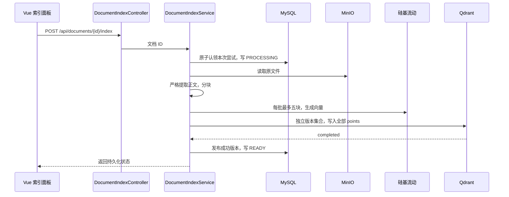

# 第 27 课：为文档建立索引，串起解析、分块和向量存储

本课给“文档管理”增加“文档索引”入口。编辑者或管理员点击后，后端读取原文件、提取正文、分块、批量生成向量，最后写入 Qdrant。处理状态保存在 MySQL，可以关闭页面后再次查看。

## 一、先做一次实验

1. 保持 MySQL、MinIO、Qdrant 运行，沿用第 25 课硅基流动配置。
2. 重启新版后端，Flyway 会应用 V8，增加索引记录表与 `document:index` 权限。重新登录编辑者或管理员账号。
3. 上传本课的 [练习文档](samples/indexing-demo.md)，点击该文件的“文档索引”。
4. 点击“建立索引”，等待处理完成，观察块数、字符数、维度、模型和建立时间。
5. 刷新页面后重新打开面板，成功版本仍然存在；原文件依旧可以下载。

本课手动处理小文档：正文最多 4000 个 UTF-16 字符、PDF 最多 50 页、最多 12 块。超过限制会拒绝整个索引，不会保存一份假装完整的截断结果。同步请求可能持续数分钟，期间不要重复点击。

Windows 如果按 [共用数据说明](windows-shared-data.md) 访问 Mac，只需更新并重启 Mac 服务。Windows 使用的仍是同一套数据。

## 二、上传成功不等于索引成功

上传成功只说明原文件已保存。本课新增的 `document_index` 表单独记录处理进度，因此原 `document.status=UPLOADED` 不变。

| 状态 | 含义 |
| --- | --- |
| NOT_INDEXED | 尚未建立索引 |
| PROCESSING | 某次索引尝试正在执行 |
| READY | 最近一次建立成功 |
| FAILED | 最近一次尝试失败，错误信息保存在记录中 |

`hasActiveIndex` 单独表达是否存在之前成功的版本。例如重建失败时，状态为 FAILED，但 hasActiveIndex 可以仍为 true。不能只看最近一次状态就把旧的成功数据当作不存在。

普通用户拥有 `document:read`，可以查看状态；EDITOR 和 ADMIN 新增 `document:index`，可以建立索引。当前知识库和文档沿用项目已有的团队共享模式，不是第 26 课的个人练习集合。

## 三、完整调用链



没有新增聊天调用，也没有自动在上传后运行。点击“建立索引”才会将提取的文本发送到硅基流动。

## 四、为何要有独立的正文提取入口

`DocumentIndexService` 调用 `DocumentService.download()`，复用从 MinIO 读取原文件和核对字节大小的逻辑。它不调用 `preview()` 或 `chunks()`，因为这两个接口允许截断。

新增 `DocumentTextExtractor.forIndex()`：

```java
public static Text forIndex(String name, byte[] bytes) {
    return extract(name, bytes, 4000, 50, true);
}
```

最后的 true 表示严格模式：字符超过预算，或者 PDF 超过页数限制，直接抛出异常。满足限制的 PDF 会读取全部页，包含预览没读取的第 21 页及之后的内容。预览仍使用原来的 40000 字符与 20 页限制，两种用途分别处理。

“严格”指不会因字符或页数限制默默丢掉尾部内容，不代表支持所有视觉内容。PDF 只解析文本层，扫描图片需要 OCR；DOCX 沿用主文档段落和表格范围，不解析页眉页脚、图片文字等。这些限制会随成功记录保存并在页面显示。空白正文会报错，不生成零块成功记录。

## 五、如何分块并调用模型

```java
var chunks = TextChunker.split(text.content(), 800, 100);
```

块上限为 800 字符，目标重叠为 100 字符。仍使用第 24 课的自然边界与 Unicode 处理；这些参数是字符单位，不能当作 token。

```java
for (int from = 0; from < chunks.size(); from += 5) {
    var batch = chunks.subList(from, Math.min(from + 5, chunks.size()))
        .stream().map(TextChunker.Chunk::text).toList();
    vectors.addAll(embedding.embed(batch));
}
```

每批最多五块；`subList` 取出本批，`map` 提取文字，Client 返回完整向量。本课先收齐全部批次，检查维度一致，再开始写 Qdrant。第二批失败时，不会把第一批当成完整索引发布。

每批继承上一课的请求超时且不自动重试。流程在批次之间及入库前检查五分钟预算；它不是可以在任意指令处强行打断的硬计时器，正在进行的模型调用仍受单次 90 秒限制。进程内最多同时处理一个文档索引。

## 六、为什么每次重建写入新版本

```java
String attempt = UUID.randomUUID().toString();
String collection = "document27_" + id + "_" + attempt.replace("-", "");
```

attempt 标识一次尝试，collection 标识这一尝试的专属集合。每个 Point 的 id 为块序号，payload 包括：

- `documentId`、`knowledgeBaseId`：原文归属。
- `chunkIndex`、`startOffset`、`endOffset`、`text`：块内容及其在提取正文中的位置。
- `revision`、`model`、`space`、`sourceSha256`：尝试版本、模型空间和原文件摘要。

SHA-256 根据原文件字节计算，用来识别这次处理的来源；它不是原文副本。offset 对应提取后的 Java 字符串，不是 PDF 页码。

所有向量写入成功后才执行 `DocumentIndexMapper.publish()`，将 active_collection 指向新集合，同时记录块数、维度、正文长度和时间。已有成功版本在此之前保持不变。

这是“先准备新版本，再发布”的做法。MySQL 和 Qdrant 之间没有共享事务，不能简单在整个方法上加一个 `@Transactional` 就宣称两者一起回滚。

## 七、Mapper 如何避免重复处理和旧请求覆盖

V8 新表以 document_id 为主键。`initialize()` 确保记录存在，`claim()` 使用一条带条件的 UPDATE：

```sql
UPDATE document_index
SET state='PROCESSING', attempt_id=?, error_message=NULL,
    updated_at=CURRENT_TIMESTAMP
WHERE document_id=?
  AND (state!='PROCESSING'
       OR updated_at < CURRENT_TIMESTAMP - INTERVAL 10 MINUTE)
```

受影响行数为 1 才算认领成功。数据库执行这一条件判断与修改，避免两个后端同时跨过“还没开始”的检查。外部 HTTP 请求期间不会一直持有数据库事务或行锁。

`publish()` 与 `fail()` 都要求 state 仍为 PROCESSING 且 attempt_id 与本次一致。即使旧任务晚回来，也无法覆盖已被新任务认领的记录。

十分钟是本课的恢复租约：进程意外退出可能留下 PROCESSING，十分钟后用户可以手动重新建立。当前不自动恢复，不提供后台任务队列或心跳续约；这些属于后续异步任务课程。

## 八、失败后发生什么

普通失败会将本次状态记为 FAILED，保留 active_collection 和之前成功的数据。若本次已经创建独立集合，会尝试清理本次集合。

数据库发布可能“执行成功但响应丢失”。因此异常处理先重新读取记录：确认集合没有成为 active_collection，才考虑删除。若数据库状态仍无法确认，保守保留集合，避免误删已发布数据。清理失败也不会删除旧版本。

本课保留历史成功集合，异常退出还可能产生孤立集合；目前不提供自动清理。后续需要根据 active_collection 做对账和保留策略，不能只按集合创建时间批量删除。

更换模型配置后，面板比较保存的模型空间与当前 `spaceId()`，明确提示重建。未来文档搜索必须仅使用 MySQL 发布的集合，并检查模型兼容性，不能扫描所有历史集合混合查询。

## 九、前端关键代码

`DocumentIndexPanel.vue` 通过文档 prop 知道当前文件。挂载时只读取状态；点击建立后发起 POST；普通用户只显示查看功能。

组件复用 `createVectorStorage()` 管理 busy、错误、请求代次和登录会话，只有仍属于当前页面与会话的结果才更新画面。父页面用文档 ID 作为 key，切换知识库会销毁面板，避免把 A 文档的结果显示到 B 文档。

关闭面板会停止浏览器接收，但不撤销已经运行的后端索引；稍后重新打开并刷新状态即可。按钮等待期间禁止重复提交，网络不确定时不会自动重试。

## 十、验证与练习

测试使用真实测试 MySQL、独立 MinIO 桶与 Qdrant 集合，Embedding 用模拟向量：验证块与原文一一对应、来源信息、原文件不变、重建版本切换、写入确认丢失时的清理、失败保留旧版本、第二批失败不发布、权限与并发认领。另用第 21 页才有文字的 PDF 验证索引没有复用预览截断。

真实硅基流动调用仍由你在配置密钥后验收，模拟测试不能证明真实语义质量。

练习：

1. 建立一次索引，再重建，观察成功时间改变而原文件没有改变。
2. 上传超过 4000 字符的文本，确认失败提示与未建立成功版本。
3. 思考：为什么状态为 FAILED 时，仍可能有一个可保留的成功版本？
4. 思考：为什么 Qdrant 保存成功后，还需要更新 MySQL 才算正式发布？

下一课增加基于已发布文档索引的检索入口，再逐步把检索文字作为上下文交给 GLM。第 26 课的个人练习集合与正式文档集合继续分开。
