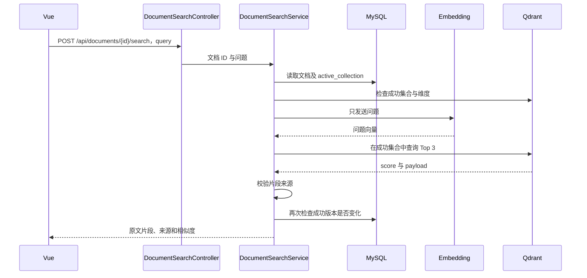

# 第 28 课：检索已发布的文档片段，展示来源

上一课把文档正文分块并保存为向量。这一课新增文档检索：输入问题，后端只为问题生成向量，在当前文档的成功索引中查找最多三个片段，并展示原文、块序号、字符范围与相似度。

## 一、操作步骤

1. 保持 MySQL、MinIO、Qdrant 运行，沿用硅基流动 Embedding 配置，重启新版后端。
2. 在“文档管理”选择文件，打开“文档索引”。如果尚无成功索引，先由 EDITOR 或 ADMIN 建立。
3. 面板下方新增“检索这份文档”，输入与文档内容有关的问题，点击查询。
4. 检查来源文件名、索引时间与返回原文，判断片段是否真的包含答案。

可沿用 [上一课练习文件](samples/indexing-demo.md)。它较短，可能只有一个块；Top 3 表示“最多三条”，不是必须返回三条。想观察不同片段的排名，可以上传并索引 [第二十四课分块实验材料](samples/chunking-demo.md)，分别询问“原文件为什么要保留？”和“重叠有什么作用？”。该材料中的功能描述属于当时课程的实验背景。

本课没有数据库迁移，不需要重建模型配置相同的已有成功索引。普通 USER 默认拥有文档读取和 AI 对话权限，也能检索；建立索引仍需要编辑者或管理员权限。

## 二、检索与聊天的区别

本课返回的是文档中已保存的原文片段，尚未让 GLM 写答案。Embedding 把问题变成向量，Qdrant 找相近向量，后端把对应文字展示出来。

目前只搜索你选中的这一份文档，不会搜索整个知识库，也不会读取第 26 课的个人练习集合。先把来源范围做清楚，下一课再将检索片段交给聊天模型。

## 三、请求顺序



查询不重新下载 MinIO 文件，也不重新向量化文档。文档向量已经在上一课建立索引时生成，这次只处理一个问题。

## 四、Controller 和权限如何工作

新增文件 `backend/src/main/java/com/example/aiknowledge/controller/DocumentSearchController.java`。

```java
public record Query(String query) {}
```

Spring 将 JSON 中的 query 绑定为 Java 对象，Controller 把它与路径中的文档 ID 交给 Service。成功响应设置 `Cache-Control: no-store`，不会向浏览器暴露内部集合名。

安全配置同时要求 `document:read` 和 `chat:send`：前者允许读取文档，后者允许调用模型。只有其中一个权限也会被拒绝。页面禁用按钮是交互提示，真正的校验发生在后端；后端会从数据库读取当前账号权限。

这些文档沿用本项目已有的团队共享规则。这里没有把个人练习库的用户集合命名方式照搬到正式文档上。未来引入知识库成员制时，还要补充对应的资源归属授权。

## 五、为什么必须读取 active_collection

新增 `DocumentSearchService.search()` 首先验证问题为 1–1000 个 UTF-16 字符且不全为空白，然后读取 MySQL：

```java
var index = indexes.find(id);
if (index == null || index.activeCollection() == null) {
    throw new ChatException(409, "文档尚无成功索引，请先由编辑者或管理员建立索引。");
}
```

只有 active_collection 指向的版本是已经发布的成功版本。Qdrant 中可能还有历史集合、正在处理的集合或异常后遗留的集合；不能按文档 ID 搜出所有集合后一起查询。

如果最近一次重建失败或正在处理，但旧成功版本仍在，可以使用旧版本，返回结果会明确提示。此时 `state` 可能不是 READY，不能只根据最近状态拒绝所有查询。

## 六、模型空间和维度为什么都要检查

```java
if (!embedding.spaceId().equals(index.activeSpace())) {
    throw new ChatException(409, "模型配置与已保存索引不一致，请重新建立索引。");
}
```

`spaceId()` 沿用服务地址与模型名的摘要。先检查空间，避免把另一个模型的问题向量与旧文档向量混用，即使两者维度相同也不允许。

接着读取 Qdrant 集合配置，检查它存在且维度、Cosine 距离规则正确。缺少集合时直接提示重建，不先调用模型。

```java
var vector = embedding.embed(List.of(query.strip())).get(0);
```

List 中只有一个问题，所以只调用一次 Embedding。得到向量后，再核对其长度与索引维度；这可以拦截相同模型配置下服务输出维度发生变化的情况。相同模型名的服务内部更新仍可能改变向量空间，这是当前摘要方案无法完全识别的边界。

## 七、Top 3 返回什么

复用第 26 课 `QdrantClient.search()`：query 是问题向量，limit 为 3，with_payload 为 true，with_vector 为 false。

后端从响应中提取：

| 字段 | 作用 |
| --- | --- |
| chunkIndex | 对应原文的第几个块，接口从 0 开始，页面显示时加 1 |
| startOffset / endOffset | 块在提取正文中的范围，左闭右开 |
| text | 上一课保存的原文片段 |
| score | Qdrant 返回的余弦相似度分数 |

例如 `[100, 300)` 表示从第 100 个 UTF-16 位置开始，到 300 之前结束，共 200 个编码单元。它不是 PDF 页码，也不是原文件的行号。

来源文件名和知识库编号取自 MySQL 文档记录，而不是任由模型生成。响应还包含成功索引的时间和提取范围说明，便于知道此次使用的是哪个时间建立的数据。

Top 3 是已有向量中最接近的几条，不代表这些文字必然能回答问题。没有答案的问题仍可能返回片段；分数不是“回答正确的概率”。本课没有添加未经样本验证的固定相似度阈值。

## 八、为什么还要校验 Payload

不能只因拿到了一个字符串就展示为正确来源。代码将 Qdrant payload 与 MySQL 成功记录比较：文档 ID、知识库 ID、原文件摘要、模型空间、模型名以及版本集合必须对应。

同时检查块序号不重复且在范围内，字符范围有效，`end-start` 等于原文片段长度，score 为有限数值。任何记录不匹配就返回错误，提示检查或重建，不把错误归属的内容混入结果。

上一课表里的 attempt_id 表示最近一次尝试，可能已是失败的新尝试。因此版本核对使用 active_collection 与 payload.revision 的对应关系，而不是把旧成功片段误拿来和最新失败的 attempt_id 比较。

## 九、查询途中重建成功怎么办

模型请求可能较慢，在等待期间另一个操作可能发布新版本。因此返回前再读取一次索引：

```java
var latest = indexes.find(id);
if (latest == null || !index.activeCollection().equals(latest.activeCollection())) {
    throw new ChatException(409, "检索期间文档索引已更新，请重新检索。");
}
```

这会拒绝在本次检查前已经过时的结果，不自动重新调用模型。检查后服务器仍可能再发生变化，所以响应始终携带本次索引时间；它不是永远随后台更新的实时结果。

Service 使用两个进程内并发名额，并在 `finally` 中释放。模型沿用 90 秒超时，Qdrant 单次请求最多 10 秒，没有自动重试。前端给整次请求留出 130 秒。

## 十、Vue 如何展示和清理结果

`DocumentSearchPanel.vue` 放在文档索引面板下方，接收 documentId 和索引是否可用。提交前显示将发送问题到模型；只显示文本插值，不把文档内容当成 HTML 执行。

状态管理复用 `createVectorStorage()` 的 search 动作：请求开始清空旧结果，busy 防止双击，generation 与 sessionVersion 防止旧请求写入新的页面或账号。关闭面板会取消浏览器接收，但不保证模型停止处理。

父组件使用文档 ID 与成功索引时间组成 key，索引面板刷新到新的成功版本时会重新创建检索组件，清空旧问题结果。切换文档或知识库也会销毁旧组件。

## 十一、验证与练习

测试验证：只查询已发布集合、不串入其他文档或历史版本、只向量化问题、返回可核对的来源、失败重建仍使用旧成功版本、模型不匹配时提前拒绝、错误 payload 不展示、查询途中版本变化时返回 409，以及两个权限缺一不可。

测试使用模拟 Embedding 和真实测试 MySQL / MinIO / Qdrant。它验证请求和数据流，不代表硅基流动的真实语义质量；真实排名需要在页面用你的密钥验收。

练习：

1. 对同一份文档问两个不同主题的问题，观察返回片段与排序。
2. 问一个文档没有涉及的问题，判断为什么“有返回结果”不等于“找到了答案”。
3. 查看块序号与字符范围，解释为什么有些片段会包含重复文字。
4. 思考：如果下一步直接让 GLM 回答，为什么必须把这些原文片段一起传给它？

下一课实现基于检索片段的回答：把问题和有来源的原文组织成上下文交给 GLM，并区分有依据的回答与资料不足的情况。
