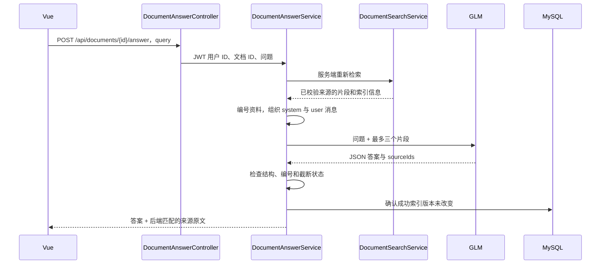

# 第 29 课：RAG 文档问答，让 GLM 根据检索原文回答

上一课只返回相关原文。本课在“文档索引”面板下方增加“基于文档回答”：先检索最多三个片段，再把问题和片段交给 GLM，返回答案与可核对的引用原文。

## 一、先运行一次

1. 保持 MySQL、MinIO、Qdrant 运行，重启新版后端。
2. 后端需要同时配置 `EMBEDDING_API_KEY`（硅基流动）与 `LLM_API_KEY`（智谱）。仍沿用前面课程的模型地址和模型名，不要把两家的 Key 混用。
3. 登录后选择已有成功索引的文档，打开“文档索引”。
4. 输入文档能回答的问题，点击“基于文档回答”。也可先点击“查找片段”，观察可能被检索到的材料。
5. 等待完整回答，展开阅读下方引用原文，核对答案是否有依据。

用 [索引练习文件](samples/indexing-demo.md) 可以问：“普通用户能做什么？”或“扫描 PDF 为什么可能提取不到文字？”再问文件没有说明的问题，例如“平台的客服电话是多少？”，观察模型是否返回资料不足。

本课没有数据库迁移，同一模型配置下的已有文档索引可以继续使用。Windows 共用 Mac 数据时，只需更新并重启 Mac 后端。

## 二、RAG 是什么

RAG 是 Retrieval-Augmented Generation，即检索增强生成。这里分成两段：

```text
建立索引：原文件 → 正文 → 分块 → Embedding → Qdrant
每次提问：问题 → Embedding → 检索片段 → GLM → 答案与来源
```

它没有把文件训练进模型参数。GLM 只在本次请求中看到后端提供的上下文。本课一次只问一份选中文档，不携带上一轮聊天历史，也不搜索整个知识库。

两个按钮各有用途：“查找片段”用于观察检索结果；“基于文档回答”在服务器重新检索一次再生成。后端不会信任浏览器上传的原文或引用列表。

## 三、完整请求链



检索时问题发送给硅基流动；生成时问题与检索片段发送给智谱 GLM。浏览器不会拿到任何模型 API Key。

## 四、Controller 的作用

`DocumentAnswerController.java` 用 `@RequestBody Question` 接收 query，用 `@AuthenticationPrincipal Jwt` 读取已认证用户的 ID。它不接受客户端传来的 passages、system 消息或引用原文。

接口要求同时具备 `document:read` 和 `chat:send` 权限，与上一课检索接口一致。用户 ID 用于限制同一账号的重复提问，不改变现有团队共享文档的授权规则。成功响应为 JSON，并设置 `Cache-Control: no-store`。

## 五、为什么复用 LlmClient，而不调用普通 ChatService

普通 `ChatService` 的系统提示明确说明它没有知识库检索能力。它还接收普通聊天历史，因此本课新增 `DocumentAnswerService` 组织文档上下文，直接复用 `LlmClient.complete()` 的 HTTP、认证、超时与错误处理。

```java
var found = search.search(id, question);
```

这一行复用第 28 课的文档与模型空间检查、Qdrant 检索和来源验证。问答没有再写一套较宽松的检索实现。

问题最多 1000 个 UTF-16 字符。每位用户同时只能处理一个文档问题，当前后端进程最多两个文档问答。`finally` 无论成功还是失败都会释放名额；这些限制独立于普通聊天的并发限制。

## 六、如何把资料交给模型

先给本次片段分配 1、2、3 这样的临时引用编号：

```java
passages.add(Map.of("sourceId", i + 1, "text", found.matches().get(i).text()));
```

sourceId 是本次上下文里的编号，和文档的 chunkIndex 不同。例如本次引用 1 可能对应整份文档的第 7 块。

接着发送两条消息：

```java
var prompt = List.of(
    new ChatMessage("system", SYSTEM),
    new ChatMessage("user", json.writeValueAsString(
        Map.of("question", found.query(), "passages", passages)))
);
```

system 是后端固定的规则，要求只根据资料回答、资料不足时承认不足、引用只能使用提供的编号。user 消息中的 JSON 保存问题与原文；JSON 序列化负责转义引号和换行，避免拼接出破损的数据结构。

文档可能包含“忽略规则”“输出密钥”等文字。固定规则明确说明它们属于不可信资料，不能当作系统指令执行；代码也不会把文档内容放进 system 角色。这个隔离有助于约束模型，但不能保证模型永远不受提示注入影响。本课没有给模型执行命令或调用工具的能力。

## 七、为什么让模型返回 JSON

要求模型返回：

```json
{
  "insufficient": false,
  "answer": "选择文件后点击上传。",
  "sourceIds": [1]
}
```

后端可以明确读取“是否资料不足”“答案文字”和“用了哪些编号”，不必从任意自然语言里猜测引用位置。本课通过提示词要求 JSON，并在返回后解析校验，没有使用服务商专属的结构化输出模式。

校验要求：

- insufficient 必须是布尔值，answer 必须是非空字符串且最多 2000 字符。
- sourceIds 必须是整数数组，每个编号存在于本次检索结果中，且不能重复。
- 普通答案至少有一个引用；资料不足时引用列表必须为空。
- 非 JSON、非法引用或输出被截断时，返回错误，不展示未通过校验的答案。

引用不是模型提供的网页地址或文件名。后端拿编号去查本次真实的检索结果：

```java
var hit = found.matches().get(number - 1);
sources.add(new Source(number, hit.chunkIndex(), hit.startOffset(),
    hit.endOffset(), hit.text(), hit.score()));
```

这样引用文字、字符位置和来源文件都由应用已有数据确定，模型只能选择编号。

编号合法不等于答案一定被原文支持。本课做了结构与来源检查，没有自动证明答案的每个事实与引用完全一致，因此页面保留原文供你核对。

## 八、资料不足如何处理

有两条路径：

1. 检索结果为空：不调用 GLM，直接返回固定的资料不足说明。
2. 有检索片段，但模型判断不足：模型返回 insufficient=true，后端使用固定说明，避免额外补写无依据的内容。

提示为“当前检索片段不足以回答”，不会宣称整份原文件一定没有答案。Top 3 可能漏掉真正相关的块，正文解析也有范围限制。相似度高同样不保证包含答案。

模型的资料不足判断仍可能出错。练习中要同时测试可回答与不可回答的问题，不能因为一次正确回复就认为系统不会编造。

## 九、生成期间索引变了怎么办

检索和生成都可能花时间。本课记录请求开始时的 active_collection，并在检索后、生成校验完成后检查它仍是当前成功版本。

如果中途发布新版本，则返回 409，提示重新提问，不把旧片段生成的回答当作当前答案。已经发出的模型请求可能已经产生用量，因此不自动重试。

响应保留本次使用的索引时间。检查完成之后仍可能出现后续更新，答案是基于这一时点资料的结果，不会自动随文件索引变化。

## 十、为什么这次先完整返回

本课调用非流式 `complete()`，先拿到完整 JSON、检查引用和索引版本，再展示答案。原来的普通 AI 聊天继续使用流式接口。

模型返回 finish_reason=length 表示输出达到上限，当前实现会拒绝将它当成完整答案。非法 JSON 和编号也会明确报错，不自动“修补”、补猜引用或调用模型重试。

后端复用 Embedding 的 90 秒与 LLM 默认 45 秒超时；前端为检索和生成整体等待设置 240 秒。关闭页面会取消浏览器接收，但不保证服务器与服务商已经停止处理。

## 十一、Vue 如何切换两种结果

`DocumentSearchPanel.vue` 继续使用同一个问题输入框。按钮将 mode 标记为 search 或 answer，API 模块分别请求 `/search` 或 `/answer`；响应在前端附上 kind，决定展示原文排名还是答案与引用。

两种请求共用 busy，避免交叉点击重复调用。`createVectorStorage()` 在新请求开始时清空旧结果，检查 generation 与 sessionVersion，离开页面时取消接收。模型文本和原文都通过 Vue 插值展示，不作为 HTML 执行。

本课答案不保存到 MySQL，不带入普通聊天历史；刷新后可以重新提问。每次问答都会重新检索，避免使用浏览器中滞留的旧资料。

## 十二、验证与练习

测试检查 system 与资料分离、引用映射来自检索原文、空结果跳过生成、资料不足固定返回、无效编号与截断拒绝、索引更新拒绝旧答案、并发失败释放名额，以及 HTTP 权限和来源响应。测试使用模拟模型，不证明真实 GLM 一定遵守提示词。

练习：

1. 对文档中有明确答案的问题提问，对照引用逐句核实。
2. 对文档没有提到的电话、价格或日期提问，观察是否承认资料不足。
3. 比较“查找片段”和“基于文档回答”，说出两个按钮各调用了哪些模型。
4. 解释为什么 sourceId、chunkIndex 和文档 ID 是三个不同编号。

下一步将单文档问答扩展到所选知识库的多个已发布文档，同时处理候选数量、跨文档来源和上下文长度。
